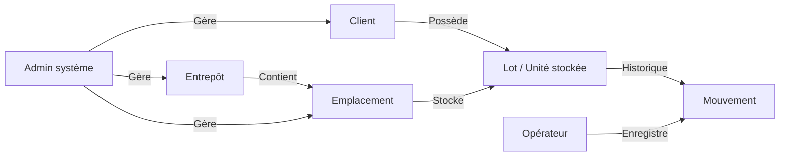
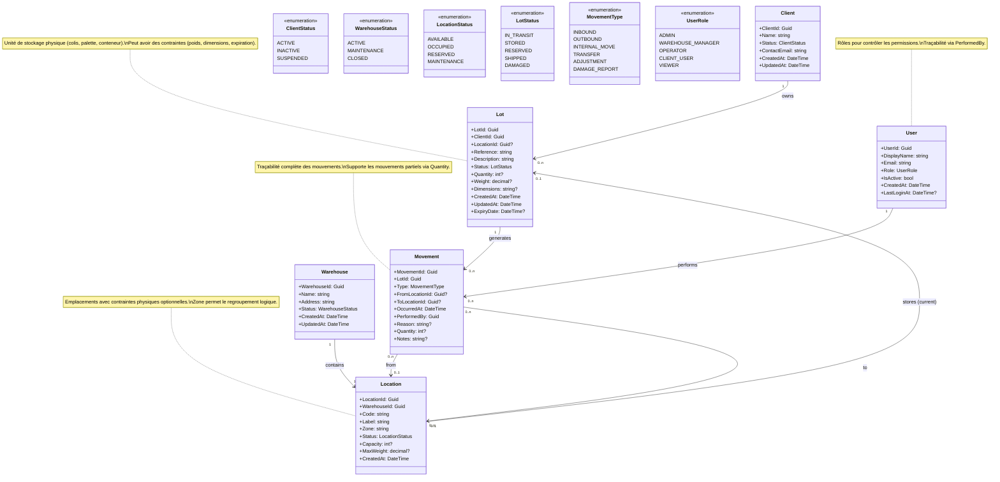
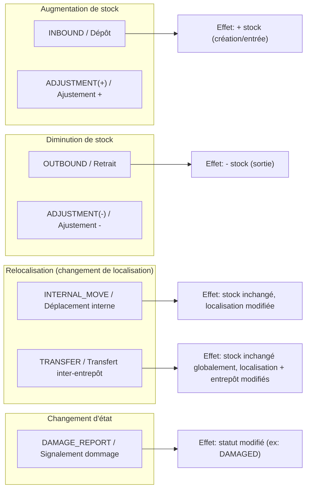
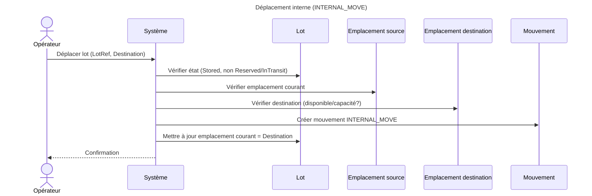
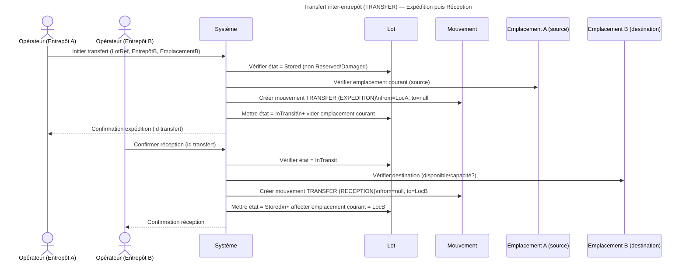

# Domain Model — Plateforme de stockage mutualisé multi-entrepôt

> Document de modélisation métier (BMAD — phase M).
> Objectif : conceptualiser le domaine (concepts, relations, flux) de manière **visuelle**.
> Hors-scope : API, base de données, choix techniques, optimisation.

---

## 1) Vue d’ensemble (concepts & interactions)



## 2) Diagramme de classes Mermaid 



## 3) Types de mouvements (taxonomie métier)

Les mouvements représentent des événements métier traçables.
Ils constituent la source de vérité de l’historique.



## 4) Cycle de vie du Lot (diagramme d’état)

Le lot traverse différents états au cours de sa vie.
Les transitions sont déclenchées par des mouvements métier.

```mermaid
stateDiagram-v2

  [*] --> Draft : Création (pré-enregistrement)

  Draft --> Stored : INBOUND / Dépôt confirmé

  Stored --> Stored : INTERNAL_MOVE
  Stored --> Reserved : Réservation (optionnel)

  %% Transfert inter-entrepôt
  Stored --> InTransit : TRANSFER (expédition)
  InTransit --> Stored : TRANSFER (réception)

  %% Retrait
  Stored --> Retrieved : OUTBOUND
  Reserved --> Retrieved : OUTBOUND

  %% Réservation
  Reserved --> Stored : Annulation réservation

  %% Dommage
  Stored --> Damaged : DAMAGE_REPORT
  Damaged --> Stored : Réintégration
  Damaged --> Retrieved : Sortie définitive

  Retrieved --> [*]
  ```

  ## 5) Diagrammes de séquence (scénarios métier)

Objectif : visualiser les interactions acteur ↔ système autour des opérations clés,
sans entrer dans des détails techniques (API/DB).

### 5.1 Dépôt (INBOUND)

```mermaid
sequenceDiagram
  title Dépôt (INBOUND)

  actor Client as Client
  actor Operator as Opérateur
  participant System as Système
  participant Lot as Lot
  participant Location as Emplacement
  participant Movement as Mouvement

  Client->>Operator: Dépôt de biens (physique)
  Operator->>System: Enregistrer dépôt (Client, LotRef, Qty?, Entrepôt)
  System->>Lot: Créer / Enregistrer Lot
  System->>Location: Assigner emplacement
  System->>Movement: Créer mouvement INBOUND
  System-->>Operator: Confirmation + identifiant lot + emplacement
````

### 5.2 Retrait (OUTBOUND)

```mermaid
sequenceDiagram
  title Retrait (OUTBOUND)

  actor Client as Client
  actor Operator as Opérateur
  participant System as Système
  participant Lot as Lot
  participant Movement as Mouvement

  Client->>Operator: Demande de retrait (physique)
  Operator->>System: Enregistrer retrait (LotRef, Qty? si partiel)
  System->>Lot: Vérifier état (Stored/Reserved?)
  System->>Movement: Créer mouvement OUTBOUND
  System->>Lot: Mettre à jour état (Retrieved ou Qty restante)
  System-->>Operator: Confirmation + reçu de retrait
```

### 5.3 Déplacement interne (INTERNAL_MOVE)



### 5.4 Transfert inter-entrepôt (TRANSFER en 2 temps)



## 6) Invariants & règles métier (conceptuels)

Objectif : capturer les règles métier qui doivent rester vraies en permanence.
Ces règles guident l’analyse (BMAD — phase A) puis seront figées via ADR / US.

> Note : ce sont des invariants **conceptuels**. Les choix exacts (MVP vs plus tard)
> seront confirmés lors des phases Analyse et Decide.

---

### 6.1 Isolation multi-clients (propriété & visibilité)

- **Un Lot appartient à un seul Client** (propriété unique).
- Un **Client ne peut consulter** que :
  - ses Lots
  - l’historique (Mouvements) de ses Lots
- Toute opération (Dépôt/Retrait/Déplacement/Transfert) doit **garantir** que le Lot manipulé appartient bien au Client concerné.

---

### 6.2 Traçabilité / Audit

- Tout événement modifiant l’état, la quantité ou la localisation d’un Lot doit créer **au moins un Mouvement**.
- Un Mouvement doit contenir au minimum :
  - `Type` (INBOUND / OUTBOUND / INTERNAL_MOVE / TRANSFER / ADJUSTMENT / DAMAGE_REPORT)
  - `OccurredAt`
  - `PerformedBy` (utilisateur/opérateur)
  - `LotId`
  - `Reason` (obligatoire pour ADJUSTMENT et recommandé pour DAMAGE_REPORT)
- L’historique des Mouvements est **append-only** (pas de modification/suppression logique du passé, sauf politique exceptionnelle).

---

### 6.3 Localisation du Lot (emplacement courant)

- Un Lot a **0..1 emplacement courant**.
  - `Stored` ⇒ emplacement courant **doit** être défini
  - `InTransit` ⇒ emplacement courant **doit** être vide
  - `Retrieved` ⇒ emplacement courant **doit** être vide
- Un Lot ne peut pas être stocké dans **deux emplacements simultanément**.

---

### 6.4 Cohérence des transitions d’état (cycle de vie)

- `Draft` ne peut passer à `Stored` que via `INBOUND`.
- `Stored` peut :
  - rester `Stored` via `INTERNAL_MOVE`
  - passer à `Reserved` (si activé)
  - passer à `InTransit` via `TRANSFER (expédition)`
  - passer à `Retrieved` via `OUTBOUND`
  - passer à `Damaged` via `DAMAGE_REPORT`
- `InTransit` ne peut revenir à `Stored` que via `TRANSFER (réception)`.
- `Retrieved` est terminal (sauf décision explicite d’un retour en stock, hors-scope par défaut).

---

### 6.5 Règles par type de mouvement (contraintes minimales)

#### INBOUND (Dépôt)
- Crée ou active un Lot.
- Doit définir un emplacement destination.
- Met le Lot dans l’état `Stored`.

#### OUTBOUND (Retrait)
- Rend le Lot `Retrieved` (ou diminue `Quantity` si lot quantifié).
- Ne doit pas laisser d’emplacement courant.

#### INTERNAL_MOVE (Déplacement interne)
- Ne change pas la quantité globale.
- Doit définir une source et une destination.
- Ne doit être autorisé que si le Lot est `Stored` (et non `Reserved`/`InTransit`/`Retrieved`).

#### TRANSFER (Transfert inter-entrepôt, 2 temps)
- Expédition : `Stored` -> `InTransit` (source définie, destination non encore confirmée)
- Réception : `InTransit` -> `Stored` (destination définie)
- Tant que `InTransit`, aucune opération de type OUTBOUND/INTERNAL_MOVE ne doit être possible.

#### ADJUSTMENT (Ajustement manuel)
- Doit exiger une justification (`Reason`).
- Peut impacter quantité et/ou localisation selon la décision retenue.
- Doit être restreint à des rôles spécifiques (manager/admin).

#### DAMAGE_REPORT (Signalement dommage)
- Met le Lot en état `Damaged`.
- Peut mener à une sortie définitive (`Retrieved`) ou à une réintégration (`Stored`) selon décision.

---

### 6.6 Capacité (optionnel)

Si la capacité est activée :
- Un emplacement ne peut pas dépasser sa capacité (unités/volume/poids selon modèle retenu).
- Toute affectation/déplacement doit vérifier la disponibilité de capacité.

---

### 6.7 Concurrence (conceptuel)

- Deux opérations concurrentes sur le même Lot ne doivent pas produire un état incohérent.
- Une opération doit échouer ou être rejouée si l’état du Lot a changé entre lecture et validation.
- Les transitions critiques (OUTBOUND, TRANSFER expédition/réception) doivent être atomiques au niveau métier.

---

## 7) Questions ouvertes & décisions à prendre

Cette section identifie les points nécessitant une analyse approfondie
avant validation définitive du modèle (BMAD — phase A puis D).

---

### 7.1 Lot quantifié ou indivisible ?

Deux options :

**Option A — Lot indivisible**
- 1 Lot = 1 unité logique
- Retrait toujours total
- Modèle plus simple
- Pas de gestion de quantité interne

**Option B — Lot quantifié**
- 1 Lot = n unités
- Retrait partiel possible
- Mouvement impacte Quantity
- Plus réaliste mais plus complexe

👉 Impact :
- Diagramme d’état
- Invariants de cohérence
- Concurrence
- Tests métier

Décision requise via ADR.

---

### 7.2 Réservation obligatoire ou non ?

Option A — Sans réservation
- Retrait direct
- Modèle simplifié

Option B — Avec état `Reserved`
- Permet de bloquer un lot avant retrait
- Utile en environnement multi-opérateurs

👉 Impact :
- Diagramme d’état
- Concurrence
- Workflow métier

---

### 7.3 Gestion des transferts inter-entrepôts

Option A — Transfert simplifié (atomique)
- 1 seul mouvement logique
- Pas d’état `InTransit`

Option B — Transfert en 2 temps
- Expédition → InTransit
- Réception → Stored
- Plus réaliste

👉 Impact :
- Cycle de vie
- Cohérence localisation
- Complexité workflow

---

### 7.4 Capacité des emplacements

Option A — Pas de capacité (MVP simplifié)
Option B — Capacité simple (nombre max)
Option C — Capacité avancée (volume + poids)

👉 Impact :
- Validation des mouvements
- Modélisation Location
- Complexité algorithmique

---

### 7.5 Accès client au système

Option A — Système interne uniquement
Option B — Portail client (lecture seule)
Option C — Portail client + demandes de retrait

👉 Impact :
- Sécurité
- Isolation multi-tenant
- Rôles utilisateur
- API publiques

---

### 7.6 Politique d’audit

Option A — Historique modifiable (rarement recommandé)
Option B — Historique immuable (append-only)

👉 Impact :
- Conformité
- Sécurité
- Architecture persistence

---

### 7.7 Gestion des retours après retrait

Un lot `Retrieved` peut-il revenir en stock ?

Option A — Non (état terminal)
Option B — Oui (nouveau INBOUND lié à l’ancien lot)

👉 Impact :
- Traçabilité
- Simplification cycle de vie
- Historique métier

---

### 7.8 Concurrence & verrouillage

Stratégies possibles :

- Verrouillage optimiste (versioning)
- Verrouillage pessimiste
- Système de réservation métier uniquement

👉 Impact :
- Performance
- UX
- Complexité technique

---

## Synthèse — Points structurants prioritaires

Les décisions suivantes sont structurantes pour le MVP :

1. Lot quantifié ou indivisible ?
2. Réservation activée dès le départ ?
3. Transfert en 2 temps ?
4. Portail client dès le MVP ?

Ces décisions feront l’objet d’ADR dans le dossier `03-decisions/`.