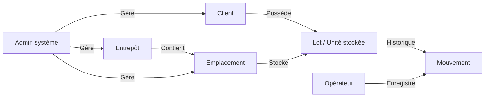
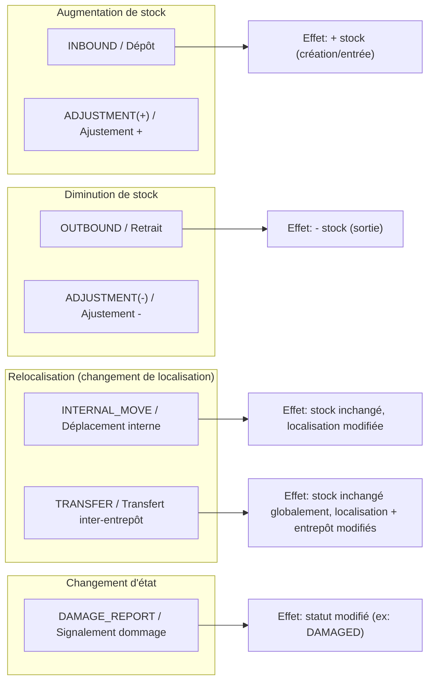
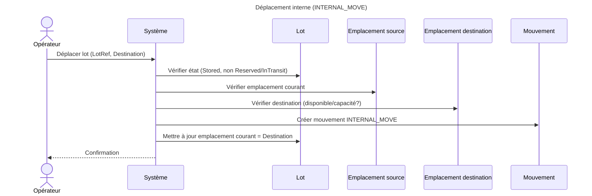
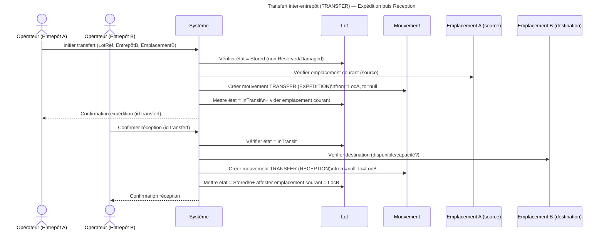

# Domain Model — Plateforme de stockage mutualisé multi-entrepôt

> Document de modélisation métier (BMAD — phase M).
> Objectif : conceptualiser le domaine (concepts, relations, flux) de manière **visuelle**.
> Hors-scope : API, base de données, choix techniques, optimisation.

---

## 1) Vue d’ensemble (concepts & interactions)



## 2) Diagramme de classes Mermaid 


## 3) Types de mouvements (taxonomie métier)

Les mouvements représentent des événements métier traçables.
Ils constituent la source de vérité de l’historique.



## 4) Cycle de vie du Lot (diagramme d’état)

Le lot traverse différents états au cours de sa vie.
Les transitions sont déclenchées par des mouvements métier.

```mermaid
stateDiagram-v2

  [*] --> Draft : Création (pré-enregistrement)

  Draft --> Stored : INBOUND / Dépôt confirmé

  Stored --> Stored : INTERNAL_MOVE
  Stored --> Reserved : Réservation (optionnel)

  %% Transfert inter-entrepôt
  Stored --> InTransit : TRANSFER (expédition)
  InTransit --> Stored : TRANSFER (réception)

  %% Retrait
  Stored --> Retrieved : OUTBOUND
  Reserved --> Retrieved : OUTBOUND

  %% Réservation
  Reserved --> Stored : Annulation réservation

  %% Dommage
  Stored --> Damaged : DAMAGE_REPORT
  Damaged --> Stored : Réintégration
  Damaged --> Retrieved : Sortie définitive

  Retrieved --> [*]
  ```

  ## 5) Diagrammes de séquence (scénarios métier)

Objectif : visualiser les interactions acteur ↔ système autour des opérations clés,
sans entrer dans des détails techniques (API/DB).

### 5.1 Dépôt (INBOUND)

```mermaid
sequenceDiagram
  title Dépôt (INBOUND)

  actor Client as Client
  actor Operator as Opérateur
  participant System as Système
  participant Lot as Lot
  participant Location as Emplacement
  participant Movement as Mouvement

  Client->>Operator: Dépôt de biens (physique)
  Operator->>System: Enregistrer dépôt (Client, LotRef, Qty?, Entrepôt)
  System->>Lot: Créer / Enregistrer Lot
  System->>Location: Assigner emplacement
  System->>Movement: Créer mouvement INBOUND
  System-->>Operator: Confirmation + identifiant lot + emplacement
````

### 5.2 Retrait (OUTBOUND)

```mermaid
sequenceDiagram
  title Retrait (OUTBOUND)

  actor Client as Client
  actor Operator as Opérateur
  participant System as Système
  participant Lot as Lot
  participant Movement as Mouvement

  Client->>Operator: Demande de retrait (physique)
  Operator->>System: Enregistrer retrait (LotRef, Qty? si partiel)
  System->>Lot: Vérifier état (Stored/Reserved?)
  System->>Movement: Créer mouvement OUTBOUND
  System->>Lot: Mettre à jour état (Retrieved ou Qty restante)
  System-->>Operator: Confirmation + reçu de retrait
```

### 5.3 Déplacement interne (INTERNAL_MOVE)



### 5.4 Transfert inter-entrepôt (TRANSFER en 2 temps)

